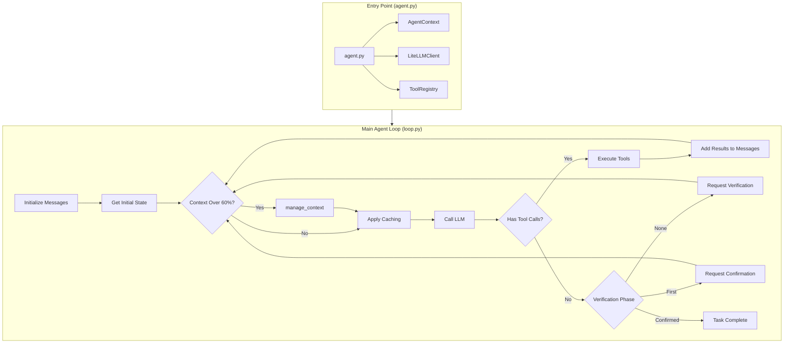
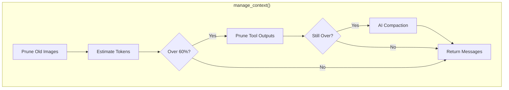
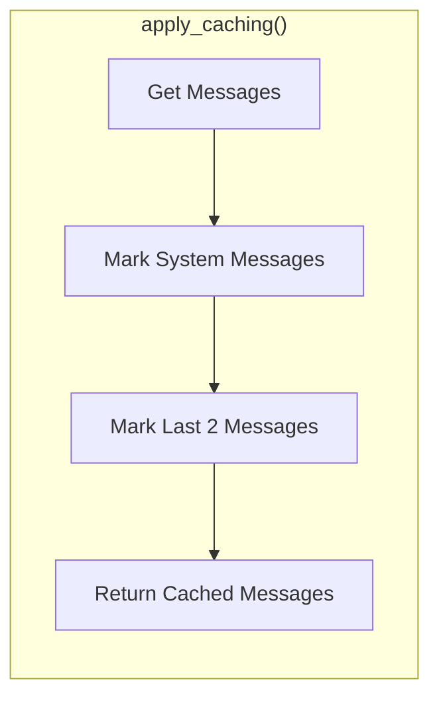
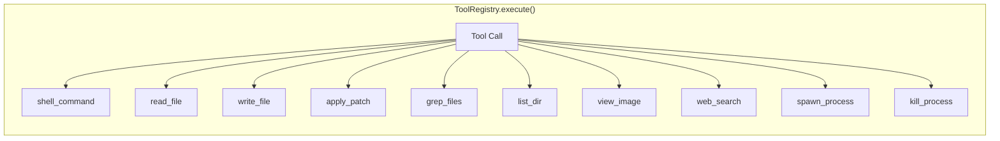
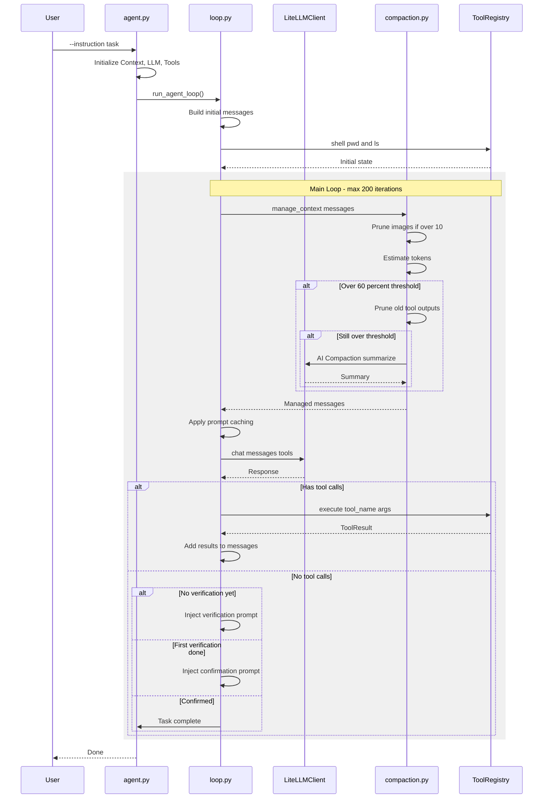
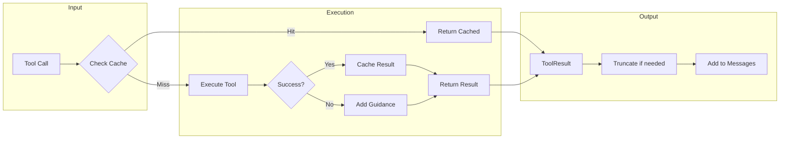
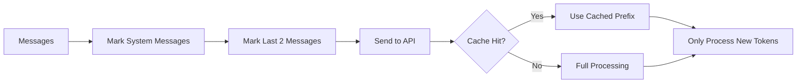
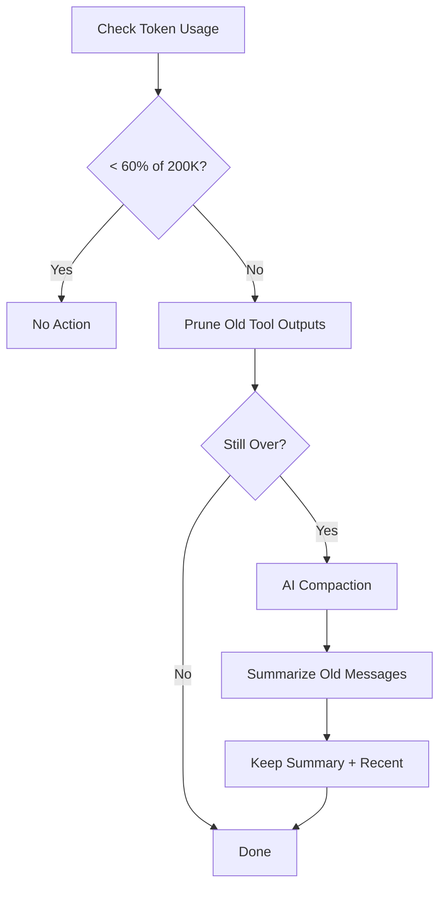
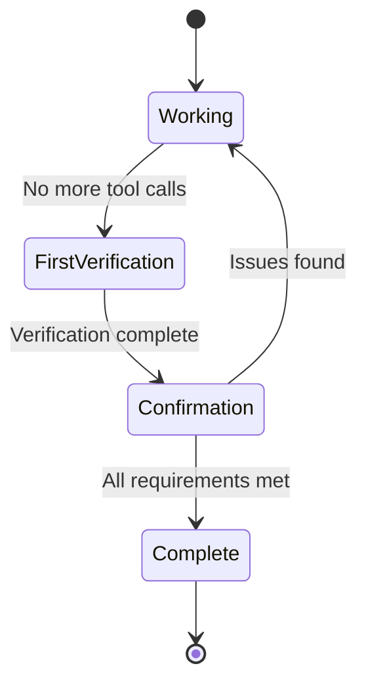

# Top Agent - Terminal Challenge Checkpoint 4 Winner

High-performance autonomous coding agent that achieved **top ranking** at [Terminal Challenge](https://term.challenge) Checkpoint 4. Built with Claude Opus 4.5 via OpenRouter, featuring advanced context management, prompt caching, and self-verification.

## Architecture Overview



## Context Management Flow



## Prompt Caching Flow



## Tool Registry



## Detailed Flow Diagram



## Tool Execution Flow



## Available Tools

| Tool | Description | Parameters | Cacheable |
|------|-------------|------------|-----------|
| `shell_command` | Execute shell commands | `command`, `workdir?`, `timeout_ms?` | No |
| `read_file` | Read file with line numbers | `file_path`, `offset?`, `limit?` | Yes |
| `write_file` | Create/overwrite files | `file_path`, `content` | No |
| `apply_patch` | Apply unified diff patches | `patch` | No |
| `grep_files` | Search with ripgrep | `pattern`, `include?`, `path?`, `limit?` | Yes |
| `list_dir` | List directory recursively | `dir_path?`, `depth?`, `limit?` | Yes |
| `view_image` | Analyze images (returns base64) | `path` | Yes |
| `web_search` | Search the web | `query`, `num_results?`, `search_type?` | Yes |
| `update_plan` | Update task plan | `steps`, `explanation?` | No |
| `transcript` | Analyze video with Gemini 3 | `url`, `instruction` | No |
| `spawn_process` | Start background process | `command`, `cwd?`, `stdout_path?` | No |
| `kill_process` | Terminate process by PID | `pid`, `signal?` | No |
| `wait_for_port` | Wait for TCP port | `port`, `host?`, `timeout_sec?` | No |
| `wait_for_file` | Wait for file existence | `path`, `timeout_sec?`, `min_size_bytes?` | No |
| `run_until_file` | Run command until file exists | `command`, `file_path`, `timeout_sec?` | No |

## Core Components

| Component | File | Purpose |
|-----------|------|---------|
| Entry Point | `agent.py` | CLI interface, initializes all components |
| Agent Loop | `src/core/loop.py` | Main agentic loop with verification |
| Context Management | `src/core/compaction.py` | Token management, pruning, AI compaction |
| LLM Client | `src/llm/client.py` | LiteLLM wrapper with cost tracking |
| Tool Registry | `src/tools/registry.py` | Tool dispatch, caching, statistics |
| System Prompt | `src/prompts/system.py` | Codex-inspired autonomous prompt |
| Output Events | `src/output/jsonl.py` | JSONL event emission for SDK |

## Key Features

### 1. Prompt Caching (90% Cost Reduction)


### 2. Context Management Strategy


### 3. Self-Verification System


## Configuration

| Parameter | Default | Description |
|-----------|---------|-------------|
| `model` | `openrouter/anthropic/claude-opus-4.5` | LLM model |
| `max_tokens` | `16384` | Max output tokens per request |
| `max_iterations` | `200` | Max loop iterations |
| `cost_limit` | `100.0` | Max cost in USD |
| `auto_compact_threshold` | `0.6` | Trigger compaction at 60% |
| `cache_enabled` | `true` | Enable prompt caching |
| `prune_protect` | `40000` | Protect last N tokens from pruning |

## Installation

```bash
pip install -e .
# or
pip install -r requirements.txt
```

## Usage

```bash
export OPENROUTER_API_KEY="your-key"
python agent.py --instruction "Your task here..."
```

## Project Structure

```
top-agent/
├── agent.py                 # Entry point
├── src/
│   ├── core/
│   │   ├── loop.py          # Main agent loop
│   │   ├── compaction.py    # Context management
│   │   └── session.py       # Session handling
│   ├── llm/
│   │   └── client.py        # LiteLLM client
│   ├── tools/
│   │   ├── registry.py      # Tool dispatcher
│   │   ├── shell.py         # Shell execution
│   │   ├── apply_patch.py   # Patch application
│   │   └── ...              # Other tools
│   ├── prompts/
│   │   ├── system.py        # System prompt
│   │   └── templates.py     # Verification prompts
│   └── output/
│       └── jsonl.py         # Event emission
├── rules/                   # Agent development guidelines
└── astuces/                 # Practical techniques
```

## License

MIT License
